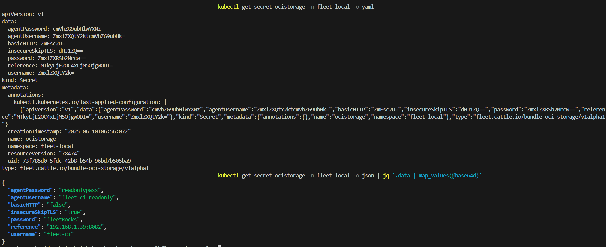

# OCI Storage

Fleet stores Kubernetes bundle resources in etcd using the K8s API. However, etcd has storage limits and is not optimized for large workloads. As your deployments scale, it is more efficient to store these resources externally in an OCI (Open Container Initiative) registry.

:::note
Fleet recommends you to compress and encode the bundle into base64 to reduce the resource size.
:::

If your bundle resources exceed the etcd size limits in the target cluster, consider using an OCI registry as the storage backend.

Using an OCI registry helps you:

* Reduce etcd load by offloading large bundle content.  
* Use a standardized storage backend for large manifests or Helm charts.

Once the OCI registry is enabled, Fleet will use it as the source for storing Bundle resources. When Fleet can't access the OCI registry, it won't fall back to default etcd storage. Instead, it logs errors.


## **Prerequisites**

* A running OCI registry.  
* A Kubernetes secret with valid credentials.  
* A Fleet installation (v2.12.0 or later) .

## Creating an OCI Storage Secret

To enable OCI Storage, you have to define a specific kind of secret. There are two ways of defining secrets

* **Global secret:** Create a secret exactly named `ocistorage` in the same namespace as your GitRepos.
  * This is the fallback secret. If no GitRepo-level secret is specified, Fleet uses this secret for all GitRepos in the namespace.  
* **GitRepo-level secret:** Create a custom secret for specific GitRepo resouces.
  * This is a user-defined secret can have any name and must be referenced in the `GitRepo` resource. 

:::note
If the referenced secret doesn't exist or contains invalid credentials, Fleet logs an error and skips deployment. It won't fall back to etcd.
:::

### GitRepo Configuration Example

If a secret named `ocistorage` exists in a namespace. Fleet automatically uses it as the OCI registry for all GitRepo resources in that namespace, and you don’t need to add ociRegistrySecret: in every GitRepo.

You can explicitly specify a different secret in the GitRepo. The GitRepo spec is extended with information about the OCI Registry. You have to update your GitRepo resource to include a reference to the secret:

```yaml
metadata:
  name: coffee-shop-deployments
  namespace: fleet-local
spec:
  repo: https://github.com/example/coffee-shop-fleet
  branch: main
  paths:
    - ./manifests
  ociRegistrySecret: ocistorage
```

The `ociRegistrySecret` references a secret in the same namespace, which contains the address and credentials needed to read/write to the OCI registry. 

```yaml
apiVersion: v1
kind: Secret
metadata:
  name: ocistorage
  namespace: fleet-local
type: fleet.cattle.io/bundle-oci-storage/v1alpha1
data:
  reference: <base64-encoded-registry-url>
  username: <base64-encoded-user>
  password: <base64-encoded-password>
  insecureSkipTLS: <base64-encoded-true/false>
  basicHTTP: <base64-encoded-true/false>
# Optional
  agentUsername: <base64-encoded-readonly-user>
  agentPassword: <base64-encoded-password>
```
:::note
Only the reference field is required. All other fields are optional. 
:::

If no username or password is specified, Fleet accesses the registry without authentication. You should follow these best practices:

* Use read-only `agentUsername` and `agentPassword` credentials for agents to enhance security.  
  * However, if you don’t set these credentials, the agent uses user credentials with read/write permissions.  
* Insecure TLS defaults to `false`, and basic http is disabled by default.   
  * Fleet allows these flags for development and testing purposes, but they should never be used in production.  
  * If you use these tags, you expose your app to security vulnerabilities, and put cluster workloads, and credentials at a risk of tampering.  
* Changing the secret does not update the deployment. The new storage registry is used only after the next Git update or when you trigger a force update.

:::note
Fleet checks for the integrity of OCI artifacts and Fleet tags OCI artifact as Latest
:::

### Fleet Example

Consider the GitRepo file for fleet-examples repository. 

```yaml
apiVersion: fleet.cattle.io/v1alpha1
kind: GitRepo
metadata:
  name: frontend-oci
  namespace: fleet-local
spec:
  repo: https://github.com/your-org/fleet-oci-example.git
  branch: main
  paths:
    - ./frontend
  ociRegistrySecret: ocistorage
```

To define OCI Secret, you can create an oci-secret.yaml file

```yaml
apiVersion: v1
kind: Secret
metadata:
  name: ocistorage
  namespace: fleet-local
type: fleet.cattle.io/bundle-oci-storage/v1alpha1
data:
  username: <base64-encoded-user>
  password: <base64-encoded-password>
  insecureSkipTLS: <base64-encoded-true/false>
  basicHTTP: <base64-encoded-true/false>
  agentUsername: <base64-encoded-readonly-user>
  agentPassword: <base64-encoded-password>
```

Run `kubectl apply -f secrets/oci-secret.yaml` before applying the GitRepo.

Or you can use `kubectl` command to create the `ocistorage` secret using unencoded text. Kubernetes converts them to base64 encoded for storing the secret.

```bash
kubectl -n fleet-local create secret generic ocistorage \
  --type=fleet.cattle.io/bundle-oci-storage/v1alpha1 \
  --from-literal=username=fleet-ci \
  --from-literal=password=fleetRocks \
  --from-literal=reference=192.168.1.39:8082 \
  --from-literal=insecureSkipTLS=true \
  --from-literal=basicHTTP=false \
  --from-literal=agentUsername=fleet-ci-readonly \
  --from-literal=agentPassword=readonlypass
```

To validate your secret, you can run:

`kubectl get secret ocistorage -n fleet-local -o yaml`

To decrypt your secret, you can run:

`kubectl get secret ocistorage -n fleet-local -o json | jq '.data | map_values(@base64d)`


